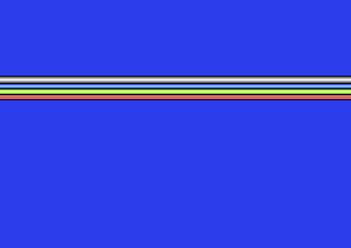

# Stable Raster Bar Demo - C64

A pixel-perfect stable raster bar demonstration for the Commodore 64, using the classic "Double IRQ + Double Compare" technique.

## Screenshot



## The Problem

When a raster interrupt fires on the C64, the CPU could be anywhere from 0-7 cycles into executing an instruction. This causes horizontal "jitter" - the raster bars wobble left and right by up to 7 pixels.

## The Solution

We use a **two-stage interrupt system**:

### Stage 1: Double IRQ

```
IRQ1 (jittery)     IRQ2 (stable)
     |                  |
     v                  v
[----+--NOP-NOP-NOP-NOP-+----]  ← Raster line
     |                  |
  0-7 cycle          0-1 cycle
   jitter             jitter
```

1. **IRQ1** fires with 0-7 cycle jitter
2. IRQ1 sets up **IRQ2** to fire on the *next* raster line
3. IRQ1 re-enables interrupts (`cli`) and executes NOP instructions
4. **IRQ2** fires *during* the NOP sled
5. Since NOPs are only 2 cycles, jitter is now reduced to 0-1 cycle

### Stage 2: Double Compare

To eliminate the final 1-cycle variance:

```asm
lda $d012       ; Read raster position
cmp $d012       ; Read again and compare
beq *+2         ; Branch takes 3 cycles if equal, 2 if not
                ; This 1-cycle difference compensates for jitter!

lda $d012       ; Do it twice for extra precision
cmp $d012
beq *+2         ; NOW we're cycle-exact!
```

## Timing

Each raster line on a PAL C64 is exactly **63 cycles**.

Our color-change code:
- `lda #color` = 2 cycles
- `sta $d020` = 4 cycles
- `DelayLine` = 57 cycles (27 NOPs + `bit $ea`)
- **Total = 63 cycles** ✓

## Screen Off Trick

We disable the screen display (DEN bit in $D011):

```asm
lda $d011
and #$ef        ; Clear bit 4
sta $d011
```

This eliminates "bad lines" where the VIC-II steals 40-43 cycles from the CPU. With screen off, **every** line is exactly 63 cycles - perfect for timing!

## Build & Run

### Requirements
- [KickAssembler](http://theweb.dk/KickAssembler/) (v5.x)
- [VICE](https://vice-emu.sourceforge.io/) (x64sc recommended)
- Java (for KickAssembler)

### Compile

```bash
java -jar ~/c64/kickassembler/KickAss.jar rasterbar.asm -symbolfile
```

Or use the provided script:

```bash
./build.sh
```

### Run

```bash
x64sc rasterbar.prg
```

Or use the automated script:

```bash
./run.sh
```

## Files

| File | Description |
|------|-------------|
| `rasterbar.asm` | Fully commented source code |
| `rasterbar.prg` | Compiled C64 program |
| `rasterbar.sym` | Symbol file for debugging |
| `build.sh` | Build script |
| `run.sh` | Run with VICE + screenshot |
| `README.md` | This file |

## Color Gradients

The demo displays four gradient bars:

1. **Grey**: Black → Dark Grey → Medium Grey → Light Grey → White → back
2. **Blue**: Black → Blue → Light Blue → Cyan → back
3. **Green**: Black → Green → Light Green → Yellow → back
4. **Red**: Black → Red → Light Red → Orange → back

## Key Learnings

| Problem | Symptom | Solution |
|---------|---------|----------|
| Single IRQ | 0-7 cycle jitter | Use Double IRQ technique |
| Single compare | 0-1 cycle jitter (8px jump) | Use Double Compare |
| Wrong delay | Slanted bar edges | Exactly 63 cycles/line |
| Bad lines | Inconsistent timing | Disable screen (DEN=0) |
| RTI with $0314 | Crash (JAM) | Use $FFFE or JMP $EA81 |

## References

- [Codebase64 - Double IRQ Explained](https://codebase64.org/doku.php?id=base:double_irq_explained)
- [Codebase64 - Stable Raster Routines](https://codebase64.org/doku.php?id=base:making_stable_raster_routines)
- [C64 Wiki - Raster Interrupt](https://www.c64-wiki.com/wiki/Raster_interrupt)

## License

Public domain - use freely for your own demos!
